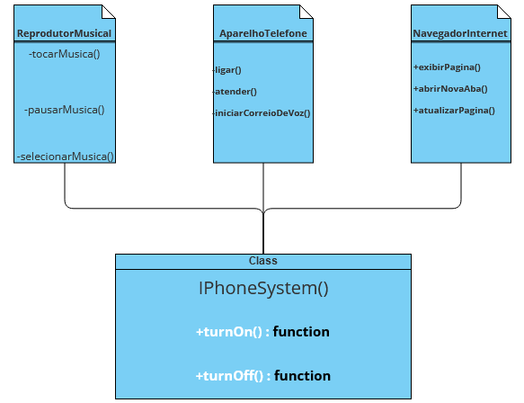

# 📲 IPhone UML - Java

Um simples UML para o cumprimento do desafio do `BootCamp - Santander - BackEnd (Java)` utilizando o site [Visual Paradigm](https://online.visual-paradigm.com/pt/diagrams/solutions/free-uml-tool/).

> **UML IPhone**

- **Reprodutor Musical**
    - tocarMusica() - private
    - pausarMusica() - private
    - selecionarMusica() - private

- **Aparelho Telefone**
    - ligar() - private
    - atender() - private
    - iniciarCorreioVoz() - private

- **Navegador Internet**
    - exibirPagina() - public
    - abrirNovaAba() - public
    - atualizarPagina() - public